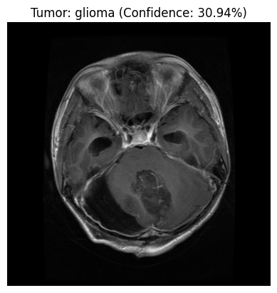
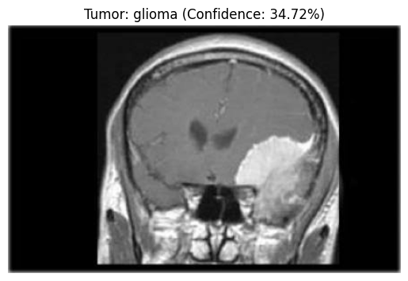
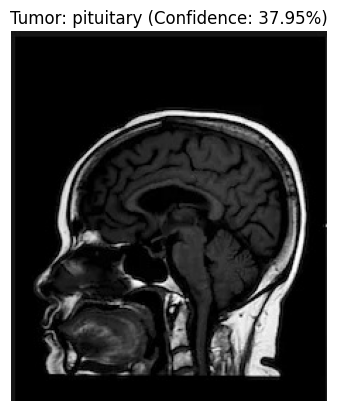
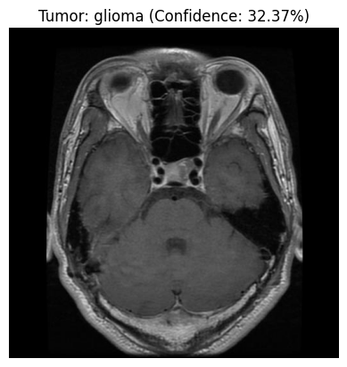

# 🧠 Brain Tumor Detection using Deep Learning & Streamlit

Welcome to this end-to-end deep learning project!  
This repository contains the code for a **Convolutional Neural Network (CNN)**, built using **Transfer Learning (VGG16)**, to classify Magnetic Resonance Imaging (MRI) scans into four categories of brain tumors.

The trained model is deployed as an interactive web application using **Streamlit**.

---

## 🚀 Deployed Application Preview

This web app allows a user to upload their own brain MRI scan.  
The model analyzes the image in real-time and provides a classification, indicating the type of tumor detected or if the scan is clear.

### Model Output Examples:

| MRI Scan (Input) | Predicted Class (Output) |
| :---: | :---: |
|  | **Meningioma** |
|  | **Glioma** |
|  | **Pituitary** |
|  | **No Tumor** |

---

## 🛠️ Tech Stack & Key Components

This project leverages several powerful libraries and frameworks:

- **Python 3.x**
- **TensorFlow & Keras:** For building, training, and fine-tuning the VGG16 model.
- **Streamlit:** For creating and serving the interactive web application.
- **Scikit-learn:** For splitting the data into training and testing sets.
- **Pillow (PIL):** For image loading and preprocessing.
- **NumPy:** For efficient data handling.

---
🎓 About the Model

The core of this project is a Transfer Learning model based on VGG16.

🔍 Architecture:

Base Model: VGG16 pre-trained on ImageNet dataset (used as a feature extractor).

Fine-Tuning: The last few convolutional layers were unfrozen and trained on the brain tumor dataset.

Classifier Head: Custom fully connected layers (Flatten → Dense → Dropout → Dense Softmax) were added for classification.

---

🧩 Classes

The model classifies MRI images into 4 distinct categories:

Glioma

Meningioma

Pituitary Tumor

No Tumor

---

📈 Model Performance

Accuracy: ~98% on test data

Loss: Very low validation loss after fine-tuning

Optimizer: Adam

Loss Function: Categorical Crossentropy

Augmentation: ImageDataGenerator used for rotation, zoom, and flipping to improve generalization

---

🧪 Future Improvements

Add Grad-CAM visualization for model interpretability

Deploy on cloud (Streamlit Cloud / Hugging Face Spaces / AWS)

Improve dataset balance for rare tumor types

---
⭐ If you like this project, give it a star on GitHub!

Would you like me to **add installation instructions for Google Colab and dataset download (Kaggle link)** section too?  
That can make the README fully ready for sharing on GitHub.

